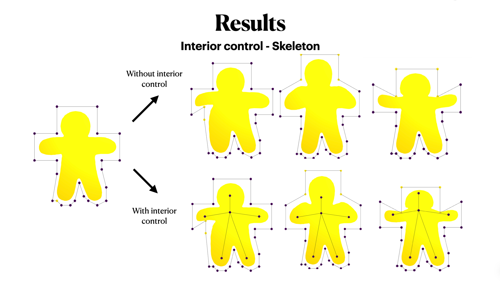
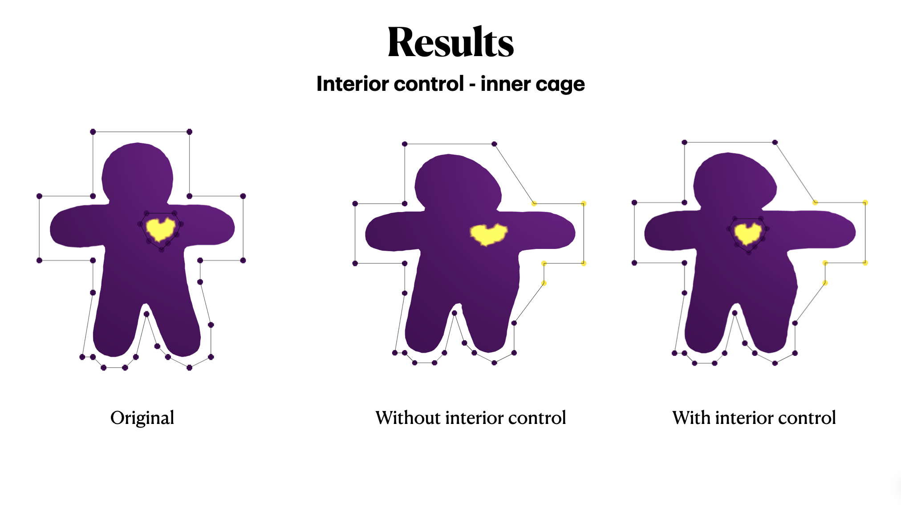

# Harmonic Coordinates

This is the final project of Geometric Modeling class 2021.

### Project Description

In this project, I implemented a 2D version of the harmonic coordinates shape deformation method as proposed in the paper [Harmonic coordinates for character articulation](https://dl.acm.org/doi/pdf/10.1145/1276377.1276466). It is a cage-based deformation method that has the nice property of non-negative coordinates values even when the cage is strongly concave.

#### Implementation

To implement it, I took the following steps:

First, define a cage for the target mesh to be deformed. Here in this project, the cage is user-defined using an interactive ipywidget similar to that used in assignment 5. 

Then I tessellate the cage with triangles using the triangle library.

Next solve the laplacian system Lx=0, with proper boundary conditions. 

Now I find which triangle each vertex in the target mesh is in, so that using barycentric coordinates as a weight, I can get the harmonic coordinates for all vertices in the target mesh.

After all this has been done, move a set of vertices in the cage, then the deformation of target mesh can be done by applying the harmonic coordinates to the new position of cage vertices.

### Some Results

##### Basic cage

- This is a visualization of the coordinates values for different cage vertices.

- [Here](https://github.com/MinervaMint/Harmonic-Coordinates/blob/master/img/Basic%20cage.mov) are some results using harmonic coordinates. 

#### Interior Control

##### Skeleton

##### Interior Cage

